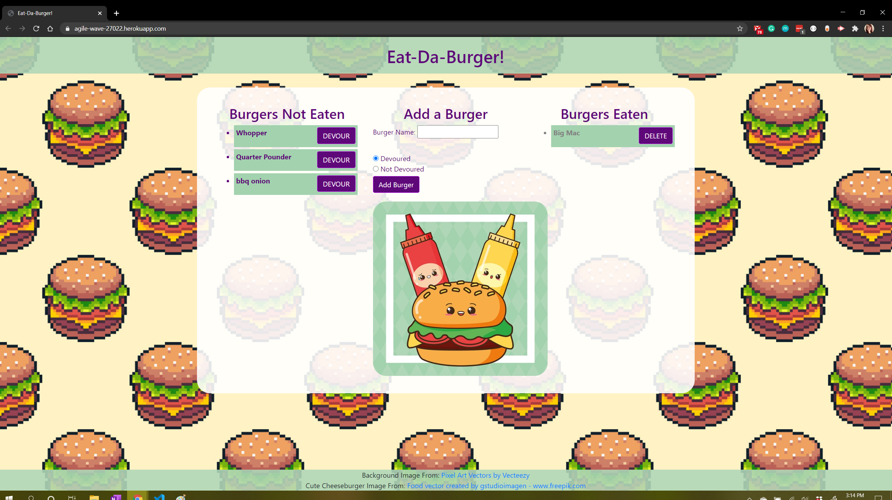

<!-- PROJECT SHIELDS -->

[![Contributors][contributors-shield]][contributors-url] [![Forks][forks-shield]][forks-url] [![Stargazers][stars-shield]][stars-url] [![Issues][issues-shield]][issues-url] [![LinkedIn][linkedin-shield]][linkedin-url]

 
<h3 align="center">Eat-Da-Burger</h3>
<p align="center">
This application uses ORM and MySQL to keep track of burgers that have been eaten.
<br />
<br />
<a href="https://agile-wave-27022.herokuapp.com/">View Demo</a>
·
<a href="https://github.com/celupanow/burger/issues">Report Bug</a>
·
<a href="https://github.com/celupanow/burger/issues">Request Feature</a>

</p>

</p>
<!-- TABLE OF CONTENTS -->

## Table of Contents

* [About the Project](#about-the-project)
	* [Built With](#built-with)
* [Getting Started](#getting-started)
	* [Prerequisites](#prerequisites)
	* [Installation](#installation)
* [Roadmap](#roadmap)
* [Contact](#contact)
* [Acknowledgements](#acknowledgements)

 
<!-- ABOUT THE PROJECT -->

## About The Project


### Built With
* [HTML](https://developer.mozilla.org/en-US/docs/Web/HTML)
* [CSS](https://developer.mozilla.org/en-US/docs/Web/CSS)
* [Handlebars](https://handlebarsjs.com/)
* [Node.js](https://nodejs.org)
* [MySQL](https://www.mysql.com/)
* [Express](https://expressjs.com/)

<!-- GETTING STARTED -->

## Getting Started
To get a local copy up and running follow these simple steps.


### Prerequisites

You will need to have the lastest version of npm installed.
* npm
```sh
npm install npm@latest -g
```
You will also need MySQL installed. There is a schema file and a seeds file included with the basic sample data you see in the working demo. If you are using MySQL Workbench, you should be able to run this script and create the database.
  
### Installation

1. Clone the repo

```sh

git clone https://github.com/celupanow/burger.git

```
2. Install the NPM packages
```sh
npm install
```
3. Run the MySQL schema and seeds to create the database
4. Run the application using the command line
```sh
node server.js
```
5. Go to localhost:8080 in your browser

<!-- ROADMAP -->

## Roadmap

  

See the [open issues](https://github.com/celupanow/burger/issues) for a list of proposed features (and known issues).

<!-- CONTACT -->

## Contact
Christina Lupanow - christina@christinalupanow.com
<p>
Project Link: [https://agile-wave-27022.herokuapp.com/](https://agile-wave-27022.herokuapp.com/)

<!-- ACKNOWLEDGEMENTS -->

## Acknowledgements
* [Heroku](https://heroku.com)


<!-- MARKDOWN LINKS & IMAGES -->

<!-- https://www.markdownguide.org/basic-syntax/#reference-style-links -->

[contributors-shield]: https://img.shields.io/github/contributors/celupanow/burger.svg?style=flat-square

[contributors-url]: https://github.com/celupanow/burger/graphs/contributors

[forks-shield]: https://img.shields.io/github/forks/celupanow/burger.svg?style=flat-square

[forks-url]: https://github.com/celupanow/burger/network/members

[stars-shield]: https://img.shields.io/github/stars/celupanow/burger.svg?style=flat-square

[stars-url]: https://github.com/celupanow/burger/stargazers

[issues-shield]: https://img.shields.io/github/issues/celupanow/burger.svg?style=flat-square

[issues-url]: https://github.com/celupanow/burger/issues

[license-shield]: https://img.shields.io/github/license/celupanow/burger.svg?style=flat-square

[license-url]: https://github.com/celupanow/burger/blob/master/LICENSE.txt

[linkedin-shield]: https://img.shields.io/badge/-LinkedIn-black.svg?style=flat-square&logo=linkedin&colorB=555

[linkedin-url]: https://www.linkedin.com/in/christinalupanow

[product-screenshot]: images/screenshot.png
<!--stackedit_data:
eyJoaXN0b3J5IjpbLTg0MzQ4OTAxMCwxMzc0NDU3ODEyLC00Mz
QxMzQxOTRdfQ==
-->